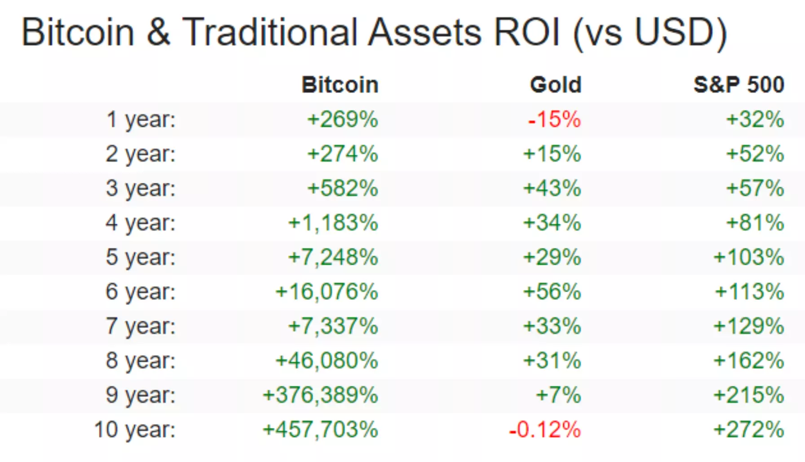

# Bitcoin Mining

## Histoire

Le white paper du bitcoin a été publié le 31 Octobre 2008 : https://bitcoin.org/bitcoin.pdf

Ensuite le premier block dans l'histoire des cryptomonnaies a été écrit le 2009-01-09 à 03:54 : https://www.blockchain.com/btc/block/1 

Le hash correspond à :
00000000839a8e6886ab5951d76f411475428afc90947ee320161bbf18eb6048

Ce block a été miné par Satoshi Nakamoto le(s) créateur(s) du bitcoin. Il contient une seule transaction et le mineur a été récompensé avec 50 btc.

## Objectifs

Le but du bitcoin tel que décrit dans le whitepaper est  de créer un système financier décentralisé appelé en anglais DEFI : DEcentralized FInance. 

Ce magnifique papier est intitulé : **Bitcoin: A Peer-to-Peer Electronic Cash System** 

Cependant, nous allons voir un peu plus loin que le bitcoin tel qu'il a été designé est utilisé aujourd'hui plutôt comme un asset qui permet de stocker de la valeur. Il est souvent appelé or digital.

En comparaison avec l'or et le fameux incide boursier S&P 500, le bitcoin a de loin surpassé les 2, le tableau ci-dessous montre la différence entre les 3 :

## Définitions

### Hash
- **SHA-2** (Secure Hash Algorithm) est une famille de fonctions de hachage qui ont été conçues par la National Security Agency des États-Unis,Cette famille comporte la fonction de hashage **SHA256**

- La fonction de Hashage est bijective, une sortie y correspond seulement à une entrée x unique

-  **SHA256** prend en entrée 
    - Le numéro de block actuel
    - les transactions qui ont été réalisées
    - le résultat du hashage du block précedent (SHA256(block_precedent))
    
- Ensuite la fonction de hashage **SHA256** donne en sortie un nombre binaire composé de 256 bits, ce dernier est converti en un chiffre hexadécimal de taille 64

### Proof of work

Le proof of work est un concept qui a apparut la première fois 

## Qu'est ce que le minage ?

Le minage consiste à participer à l'entretien et le maintien de la blockchain.
Ce processus permet de créer des nouveaux BTC donnés comme récompense aux mineurs.
Le processus consiste à mettre en concurrence des personnes qui cherchent à résoudre un problème de cryptographie.

La difficulté était de 1 (8 zéro au début du hash en sortie)

- Pour miner du bitcoin est de 
